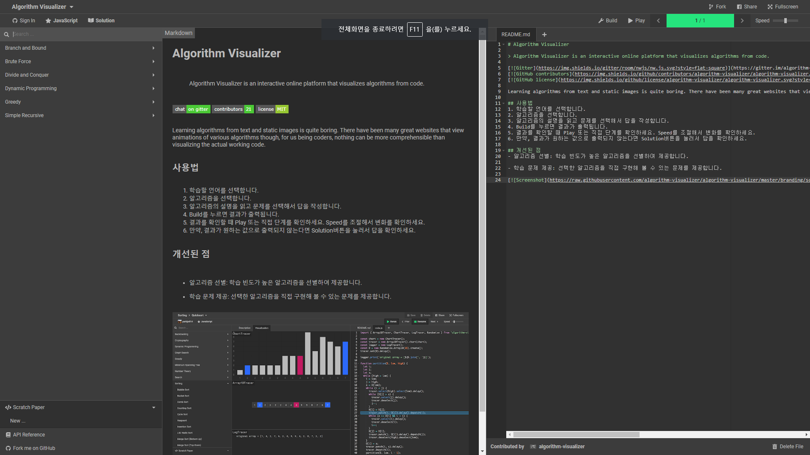

# 2019-1-OSSP2-Riders-8

> Algorithm Visualizer 개선하기.
[](https://github.com/algorithm-visualizer/algorithm-visualizer/blob/master/LICENSE)

# 팀원
2014110400 정원영 - java Tracer API를 이용한 코드 작성

2014110416 권성호 - c++ Tracer API를 이용한 코드 작성

2014110425 임성호 - 팀장, 서버 및 프론트 개발

# 오픈소스

- Algorithm-Visualizer: [https://github.com/algorithm-visualizer/algorithm-visualizer](https://github.com/algorithm-visualizer/algorithm-visualizer)

- Algorithms: [https://github.com/algorithm-visualizer/algorithms](https://github.com/algorithm-visualizer/algorithms)

- Code Editor: [https://github.com/securingsincity/react-ace](https://github.com/securingsincity/react-ace)

- Brace: [https://github.com/thlorenz/brace](https://github.com/thlorenz/brace)

# 개발 환경

```
OS: Windows 10

Tool: node.js, javascript, jsx, scss
```

# 프로젝트 설명

- 웹 브라우저를 이용하여 사용자가 입력한 알고리즘 코드를 시각화해줍니다.

- 사용자는 프로그램을 이용하여 알고리즘을 학습할 수 있습니다.

- Tracer API의 사용법을 익힌다면 자신이 직접 시각화 코드를 작성해 볼 수 있습니다.

# 설치

공통 사항 - node.js(LTS), Visual Studio Code

Windows 10 버전 별 Docker 설치 방법

*****

- Windows 10 pro
    1. Docker Desktop 설치
    2. [https://docs.microsoft.com/ko-kr/virtualization/hyper-v-on-windows/about/](https://docs.microsoft.com/ko-kr/virtualization/hyper-v-on-windows/about/)를
        참고하여 Hyper-v 설정
    3. 프로젝트를 설치할 경로가 포함된 디스크 드라이버의 공유 권한을 설정
            
    4. Docker Desktop을 실행

*****

- Windows 10 home
    1. Oracle VM VirtualBox 설치 
    2. Docker Toolbox 설치
    3. 이더넷 설정
        
        
    4. VirtualBox의 가상머신에서 프로젝트를 설치할 경로가 포함된 디스크 드라이버의 공유 권한을 설정
        
        
    5. 프로젝트의 temp경로에서 tracer.js를 복사하여 src/backend/controllers에 붙여넣기
    6. Docker Quickstart Terminal을 실행
        

*****

- 로컬에 프로젝트 설치하기

    1. 로컬에 저장소 설치

    ``` bash
    git clone https://github.com/CSID-DGU/2019-1-OSSP2-Riders-8.git
    ```

    2. 디렉토리 구조 갖추기

    ``` bash
    cd 2019-1-OSSP2-Riders-8/src/backend
    mkdir public
    cd public
    mkdir codes
    git init
    git clone https://github.com/giantim/algorithms.git
    npm install
    ```

    3. node_modules를 수정. 아래를 설치해서 mode와 theme를 node_modules/brace에 복사한다.

    ``` bash
    git clone https://github.com/giantim/react-ace_theme.git
    ```

    4. Docker가 실행중인 상태에서 Visual Studio Code를 사용하여 서버 빌드


# 실행 결과


# 문의
임성호 - giantim132@gmail.com
